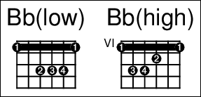

# Configuration file contents - Generic

## General settings

These settings control global behaviour of the ChordPro program and can be changed from the command line.

    // General settings, to be changed by legacy configs and
    // command line.
    "settings" : {
        // Titles flush: default center.
        "titles" : "center",
        // Columns, default one.
        "columns" : 1,
        // Suppress empty chord lines.
        // Overrides the -a (--single-space) command line options.
        "suppress-empty-chords" : true,
        // Suppress chords.
        // Overrides --lyrics-only command line option.
        "lyrics-only" : false,
    },

## Metadata

The `metadata` setting contains three items:

* `keys`: The list of recognized metadata keys.  
For these keys you can use `{meta` _key_ ...`}` as well as `{`_key_ ...`}`.
* `strict`: If true, `{meta` ...`}` will accept any key.  
Otherwise, only the keys named in the `keys` here are allowed.
* `separator`: To concatenate multiple values when metadata are used in title fields.

Important: the keys `title` and `subtitle` must always be in this list.

    "metadata" : {
        "keys" : [ "title", "subtitle",
                   "artist", "composer", "lyricist", "arranger",
                   "album", "copyright", "year",
                   "key", "time", "tempo", "capo", "duration" ],
        "strict" : true,
        "separator" : "; ",
    },

See also [[Using metadata in texts|ChordPro Configuration Format Strings]].

## Strings and Tuning

Define the instrument tuning as a list of notes in [scientific pitch notation](https://en.wikipedia.org/wiki/Scientific_pitch_notation).

For example, to specify tuning for a 4-string [soprano ukulele](https://en.wikipedia.org/wiki/Ukulele#Tuning):

    "tuning" : [ "G4", "C4", "E4", "A4" ],

Setting the tuning to any value except `null` will discard all built-in chords!

## User defined chords

The configuration file can hold any number of predefined chords.

    // "base" defaults to 1.
    // Use 0 for an empty string, and -1 for a muted string.
    "chords" : [
        {
            "name"  : "Bb(low)",
            "base"  : 1,
            "frets" : [ 1, 1, 3, 3, 3, 1 ],
            "fingers" : [ 1, 1, 2, 3, 4, 1 ],
        },
        {
            "name"  : "Bb(high)",
            "base"  : 6,
            "frets" : [ 1, 3, 3, 2, 1, 1 ],
            "fingers" : [ 1, 3, 4, 2, 1, 1 ],
        },
    ],

The resulting chords will look similar to:

## Printing chord diagrams

By default, ChordPro will include diagrams for all known chords that have been used in a song.

    // "auto": automatically add unknown chords as empty diagrams.
    // "show": prints the chords used in the song.
    //         "all": all chords used.
    //         "user": only prints user defined chords.
    //         "none": no song chords will ne printed.
    // "sorted": order the chords by key.
    "diagrams" : {
        "auto"     :  false,
        "show"     :  "all",
        "sorted"   :  false,
    },

If `auto` is set to true, unknown chords will be printed as empty diagrams. This makes it easy to manually put the finger positions on paper. Of course, adding a [chord definition](#user-defined-chords) is usually a better alternative.

## Table of Contents

Here you can set the title text for the table of contents. By default
this is the string `"Table of Contents"`.

The song titles in the table of contents are in the same order as in
the document. By setting `order` to `"alpha"`, the titles are sorted
alphabetically.

    // Table of contents.
    "toc" : {
	  // Title for ToC.
	  "title" : "Table of Contents",
	  // Sorting order.
	  // Currently only sorting by page number and alpha is implemented.
	  "order" : "page",
    },

## Includes

A config file can specify a list of other config files that are to be processed *before* the contents of the current file. This makes it straightforward to create config files that extend existing config files.

For example:

    { "include" : [ "modern1" ],
      "settings" : {
          "colums" : 2
      }
    }

This config file would first load the preset config `modern1`, and then set the number of output columns to 2.

`include` takes a list of preset configs like `modern1`, or file names. If a file name is not absolute, it is taken relative to the location of the including config file.

## Diagnostic message format

When ChordPro detects errors while analyzing a song, it will use this format to show diagnostic messages.

In the format, `%f` will be replaced by the song file name, `%n` by the line number in the file where the error was detected, `%m` by the diagnostig message, and `%l` will be replaced by the original content of the line.

    "diagnostics" : {
        "format" : "\"%f\", line %n, %m\n\t%l",
    },
