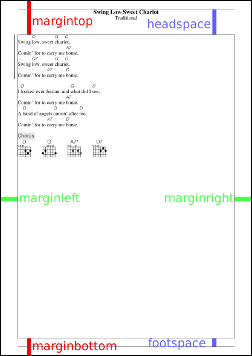

# Configuration file contents - PDF output

Layout definitions for PDF output are stored in the configuration under the key `"pdf"`.

    {
       // ... generic part ...
       "pdf" : {
         // ... layout definitions ...
       },
    }

#### Papersize

The size of the paper for which output must be formatted. The size can be specified either as the name of a known page size, e.g. `"a4"`, or as a 2-element list containing the width and height of the page in _PDF units_ (_DTP points_, _pt_, 1/72 inch).

        "papersize" : "a4",
        // Same as: "papersize" : [ 595, 842 ]

#### Inter-column space

When output is produced in multiple columns, this is the space between the columns, in pt.

        "columnspace"  :  20,

#### Page margins

Click on the image for a larger version.

        "margintop"    :  80,
        "marginbottom" :  40,
        "marginleft"   :  40,
        "marginright"  :  40,
        "headspace"    :  60,
        "footspace"    :  20,

#### Heading on first page only

Put the heading on the first page only, and add the headspace to the other pages so they become larger.

        "head-first-only" : false,

#### Spacing

This controls the distance between lines as a factor of the font size.

        "spacing" : {
            "title"  : 1.2,
            "lyrics" : 1.2,
            "chords" : 1.2,
            "grid"   : 1.2,
            "tab"    : 1.0,
            "toc"    : 1.4,
            "empty"  : 1.0,
        },

Note: By setting the font size and spacing for empty lines to smaller values, you get fine-grained control over the spacing between the various parts of the song.

#### Chorus style

ChordPro can format a chorus in several different ways.

        "chorus" : {
            // Indentation of the chorus.
            "indent"     :  0,
            // Chorus side bar.
            // Suppress by setting offset and/or width to zero.
            "bar" : {
                 "offset" :  8,
                 "width"  :  1,
                 "color"  : "black",
            },
            // Recall style: Print the tag using the type.
            // Optionally quote the lines of the preceding chorus.
            "recall" : {
                 "tag"   : "Chorus",
                 "type"  : "comment",
                 "quote" : false,
            },
        },

####

        // Alternative songlines with chords in a side column.
        // Value is the column position.
        // "chordscolumn" : 400,
        "chordscolumn" :  0,

        // A {titles: left} may conflict with customized formats.
        // Set to non-zero to ignore the directive.
        "titles-directive-ignore" : false,

        // Chord grids.
        // A chord grid consists of a number of cells.
        // Cell dimensions are specified by "width" and "height".
        // The horizontal number of cells depends on the number of strings.
        // The vertical number of cells is "vcells", which should
        // be 4 or larger to accomodate most chords.
        // The horizontal distance between grids is "hspace" cells.
        // The vertical distance is "vspace" cells.
        // "linewidth" is the thickness of the lines as a fraction of "width".
        "chordgrid" : {
            "width"    :  6,
            "height"   :  6,
            "hspace"   :  3.95,
            "vspace"   :  3,
            "vcells"   :  4,
            "linewidth" : 0.1,
        },

        // Even/odd pages. A value of -1 denotes odd/even pages.
        "even-odd-pages" : 1,

        // Formats.
        "formats" : {
            // Titles/Footers.

            // Titles/footers have 3 parts, which are printed left,
            // centered and right.
            // For even/odd printing, the order is reversed.

            // By default, a page has:
            "default" : {
                // No title/subtitle.
                "title"     : null,
                "subtitle"  : null,
                // Footer is title -- page number.
                "footer"    : [ "%{title}", "", "%{page}" ],
                // Title for ToC.
                "toc-title" : "Table of Contents",
            },
            // The first page of a song has:
            "title" : {
                // Title and subtitle.
                "title"     : [ "", "%{title}", "" ],
                "subtitle"  : [ "", "%{subtitle}", "" ],
                // Footer with page number.
                "footer"    : [ "", "", "%{page}" ],
            },
            // The very first output page is slightly different:
            "first" : {
                // It has title and subtitle, like normal 'first' pages.
                // But no footer.
                "footer"    : null,
            },
        },

        // Fonts.
        // Fonts can be specified by name (for the corefonts)
        // or a filename (for TrueType/OpenType fonts).
        // Relative filenames are looked up in the fontdir.
        "fontdir" : null,

        // Fonts for chords and comments can have a background
        // colour associated.
        // Colours are "#RRGGBB" or predefined names like "black", "white",
        // and lots of others.

        "fonts" : {
            "title" : {
                "name" : "Times-Bold",
                "size" : 14
            },
            "text" : {
                "name" : "Times-Roman",
                "size" : 12
            },
            "chord" : {
                "name" : "Helvetica-Oblique",
                "size" : 10
            },
            "comment" : {
                "name" : "Helvetica",
                "size" : 12
            },
            "tab" : {
                "name" : "Courier",
                "size" : 10
            },
            "toc" : {
                "name" : "Times-Roman",
                "size" : 11
            },
            "grid" : {
                "name" : "Helvetica",
                "size" : 10
            },
        },

        // Fonts that can be specified, but need not.
        // subtitle       --> text
        // comment        --> text
        // comment_italic --> chord
        // comment_box    --> chord
        // toc            --> text
        // grid           --> comment
        // footer         --> subtitle @ 60%
        // empty          --> text
        // chordgrid      --> comment
        // chordgrid_capo --> text (but at a small size)

        // This will show the page layout if non-zero.
        "showlayout" : false,

