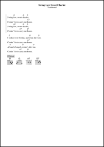
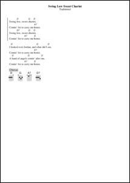

## Preset configurations
ChordPro comes with a number of standard configurations.

It is important to know that ChordPro always loads the default configuration and then adds the other configurations.

* In the GUI, there is a dropdown list for the presets in the Preferences dialog.
* On the command line, use `--config`, e.g., `--config=myconf.json`.

_Click on the page thumbnails to see the full size version._

### Default
As the name implies, this is the default configuration. It accepts all ChordPro version 5 input.

### Chordii
This preset configuration makes the output look as closely as possible to the output of the _Chord_ii program.

### Modern1
A nice, modern style.

### Modern2
An alternative modern style.

### Nashville
A special style for songs that use Nashville numbering notation.

### Roman
A special style for songs that use Roman numbering notation.

### Ukulele
This preset adds 4-chord tuning and ukulele chords.

