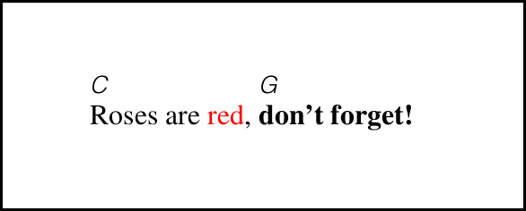
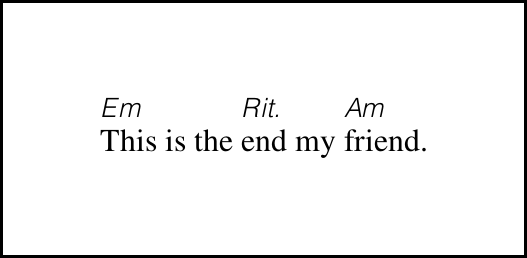

# ChordPro Release info

## ChordPro version 6

### Markup

In all texts (lyrics, titles, chordnames, comments, etc.) markup
instructions can be used to manipulate the appearance.

The markup instructions conform to the [Pango Markup
Language](Pango_Markup.html).

For example:

    [C]Roses are red, [G]<b>don't forget!</b>
	
The reference implementation will produce something similar to:

### Annotations

Annotations are arbitrary remarks that go with a song. They are
specified just like chords, but start with an `*` symbol.

For example:

    [Em]This is the [*Rit.]end my [Am]friend.

The reference implementation will produce something similar to:

Even though they are written using chord-like syntax, it is important
to know that annotations are _not_ chords. In particular:

- ChordPro processing tools may choose to show annotations in a
  different way than chords.
- No attempts will be made to transpose, transcode, or draw chord
  diagrams for annotations.
