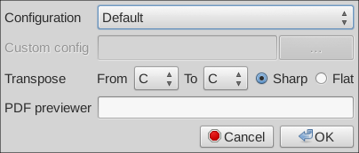
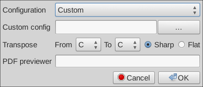
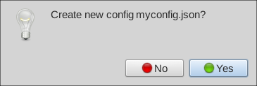

_Note that the appearance of dialogs and file names may differ between systems._

From the `Edit` menu choose `Preferences...`.

From the dropdown list, select `Custom`.

Click the `...` button to open a file dialog.  
Select a folder and enter the name of a new file, for example `myconfig.json`.  
Click `Open`.

The new configuration file will be created and filled with default configuration values.