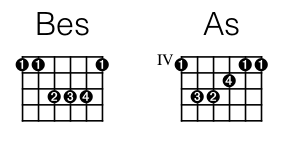

## define

This directive defines a chord in terms of fret/string positions and, optional, finger settings.

`{define:` _name_ `base-fret` _offset_ `frets` _pos_ _pos_ … _pos_`}`  
`{define:` _name_ `base-fret` _offset_ `frets` _pos_ _pos_ … _pos_ `fingers` _pos_ _pos_ … _pos_`}`

* _name_ is the name to be used for this chord. If it is an already known chord the new definition will overwrite the previous one.

* `base-fret` _offset_ defines the offset (the lowest fret) for the chord. The offset must be 1 or higher.

* `frets` _pos_ _pos_ … _pos_ defines the string positions, all relative to the offset. `0` (zero) denotes an open string. Use `N` or `x` to denote a non-sounding string.

Strings are enumerated from left (lowest) to right (highest), as they appear in the chord diagrams.

`fingers` _pos_ _pos_ … _pos_ defines finger settings. This part may be omitted.

For the `frets` and the `fingers` positions, there must be exactly as many positions as there are strings, which is 6 by default.

Example:

    {define: Bes offset 1 frets 1 1 3 3 3 1 fingers 1 1 2 3 4 1}
    {define: As  offset 4 frets 1 3 3 2 1 1 fingers 1 3 4 2 1 1}

The resultant chord diagrams are:

See also: [[chord|Directives chord]].
