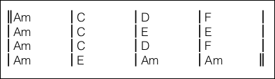
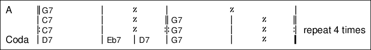

## start_of_grid

This directive indicates that the lines that follow define a chord grid in the style of [Jazz Grilles](https://fr.wikipedia.org/wiki/Grille_harmonique).

In a grid only chords are used, no lyrics, and the chords are arranged in a rectangular pattern for a quick view on the structure of the song. Symbols for bar lines and repeats can also be included in a grid.

For example, to create a grid for ‘The House of the Rising Sun’:

    {start_of_grid}
    || Am . . . | C . . . | D  . . . | F  . . . |
    |  Am . . . | C . . . | E  . . . | E  . . . |
    |  Am . . . | C . . . | D  . . . | F  . . . |
    |  Am . . . | E . . . | Am . . . | Am . . . ||
    {end_of_grid}

The result could look like:

The grid consists of a number of cells that can contain chords.
The desired number of cells per line can be specified as an argument to the `start_of_grid` directive:

`{start_of_grid` _cells_ `}`  
`{start_of_grid` _measures_ `x` _beats_ `}`

There is no semantic difference between the two forms, just pick the one that is most convenient.

The grid input lines consist of space-separated tokens, which are either valid chords or special symbols. Spaces are not significant but can be used e.g. to align chords in the input lines. 

Chords are put into the cells. If a cell does not need to contain a chord, the placeholder `.` (period) can be used to designate an empty cell.

Between the cells bar lines can be placed. In the above example, each line contains 16 cells and the bar lines divide the cells into 4 groups (measures) of 4 cells (beats). 

The following bar line symbols are valid:

* `|` single bar line
* `||` double bar line
* `|.` end bar line
* `|:` start repeat bar line
* `:|` stop repeat bar line
* `:|:` combined stop/start repeat bar line

Each line must start and end with a bar line. However, the last bar line may be followed by comment text that is included in the grid for display purposes.

Other symbols that can be used:

* `%` denotes that this measure should be playes just like the previous measure. The rest of the measure must remain blank.
* `%%` denotes that the last two measures must be repeated. The rest of this measure and the following measure must remain blank.

Example:

    {start_of_grid 4x2}
    || G7 . | % . | %% . | . . |
    | C7 . | %  . || G7 . | % . ||
    |: C7 . | %  . :|: G7 . | % . :| repeat 4 times
    | D7 . | Eb7 | D7 | G7 . | % . |.
    {end_of_grid}

The result will be similar to:

## end_of_grid

This directive indicates the end of the grid.
