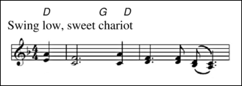

## image

`{image:` `src=`_filename_ _options_ `}`

Includes a bitmap image.

`src=`_filename_  
Specifies the name of the file containing the image. Supported file types are PNG, JPG and GIF.  
Note that the syntax of file names may depend on the platforms and tools used. A simple file name like "myimage.png" is always acceptable. 	

The optional _options_ can be used to control the appearance of the image. Single or double quotes can be used if spaces are to be included in the option values.

`width=`_width_  
Specifies the desired width of the image in typographic points (1/72 inch or 0.3528 mm). If neccessary the original image is scaled to fit.	

`height=`_height_  
Specifies the desired height of the image. If neccessary the original image is scaled to fit.	

`scale=`_factor_  
Scales the image with the factor.	

`center=`_tf_  
`center`  
The image is horizontally centered on the page or column. If _tf_ equals `0`, the image is flushed left.

`border=`_width_  
`border`  
Draws a border around the image. Without an explicit width, the border is one typographic point.

`title=`_text_  
Provides a title for the image.

Example:

    Swing [D]low, sweet [G]chari[D]ot
    {image: src="score.png" center=0}

The result will be similar to:

