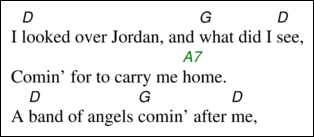

# Directives: chordfont, chordsize, chordcolour

Note: If the intention is to change the appearance for the whole song, or collection of songs, it is much better to use [[configuration files|ChordPro Configuration]] instead.

These directives change the font, size and colour of the song chords that follow.

The font must be a [[known font name|ChordPro Fonts]], or the name of a file containing a TrueType or OpenType font.

The size must be a valid number like `12` or `10.5`, or a percentage like `120%`. If a percentage is given, it is taken relative to the current value for the size.

The colour must be a [[known colour|ChordPro Colours]], or a hexadecimal colour code like `#4491ff`.

Example:

    I [D]looked over Jordan, and [G]what did I [D]see,
    {chordcolour: green}
    Comin’ for to carry me [A7]home.
    {chordcolour}
    A [D]band of angels [G]comin’ after [D]me,

The chords of the second song line will be printed in green.

