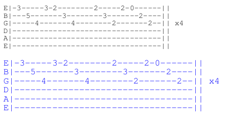

# Directives: tabfont, tabsize, tabcolour

Note: If the intention is to change the appearance for the whole song, or collection of songs, it is much better to use [[configuration files|ChordPro Configuration]] instead.

These directives change the font, size and colour of the guitar TAB that follow.

The font must be a [[known font name|ChordPro Fonts]], or the name of a file containing a TrueType or OpenType font.

The size must be a valid number like `12` or `10.5`, or a percentage like `120%`. If a percentage is given, it is taken relative to the current value for the size.

The colour must be a [[known colour|ChordPro Colours]], or a hexadecimal colour code like `#4491ff`.

Example:

	{start_of_tab}
	E|-3-----3-2--------2-----2-0------||
	B|---5-------3--------3-------2----||
	G|-----4-------4--------2-------2--|| x4
	D|---------------------------------||
	A|---------------------------------||
	E|---------------------------------||
	{end_of_tab}

	{tabcolour: blue}
	{tabsize: 120%}
	{start_of_tab}
	E|-3-----3-2--------2-----2-0------||
	B|---5-------3--------3-------2----||
	G|-----4-------4--------2-------2--|| x4
	D|---------------------------------||
	A|---------------------------------||
	E|---------------------------------||
	{end_of_tab}

The second TAB section will be printed in blue with a 20% larger font size.

